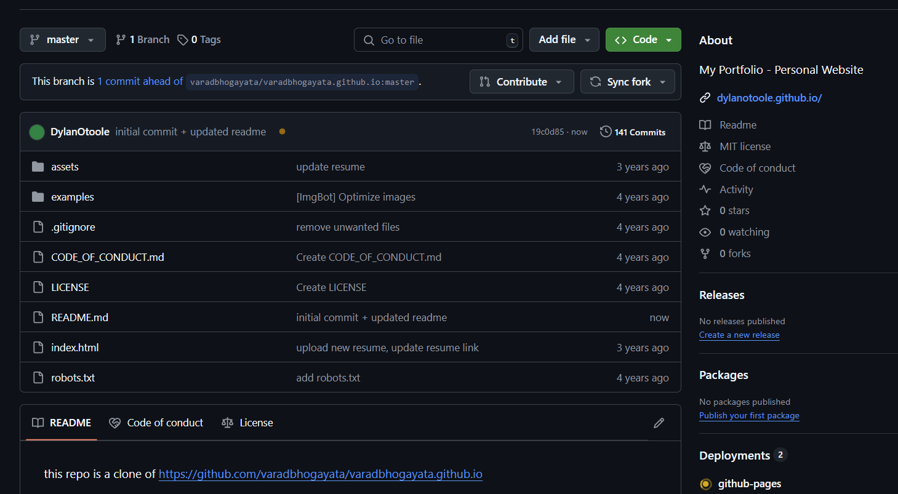

## this repo is a clone of [https://github.com/varadbhogayata/varadbhogayata.github.io](https://github.com/varadbhogayata/varadbhogayata.github.io)

## Activity 1:

## Activity 2:

## Activity 3:

## Activity 4:

## Activity 5:

